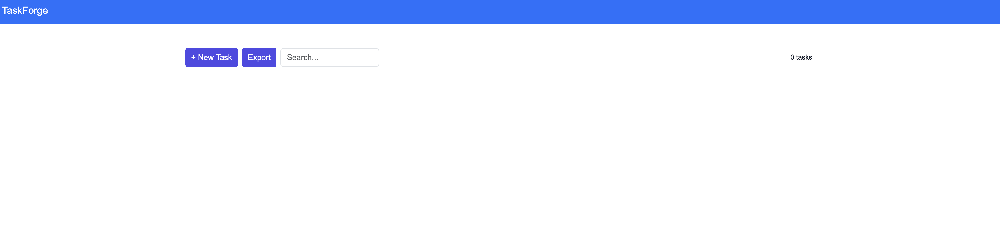

# TaskForge

TaskForge is a personal task management web application built with **Blazor WebAssembly**. It offers a clean, responsive, and modular experience for managing tasks with priorities, due dates, and intuitive drag-and-drop ordering. The application is designed with modern .NET practices, emphasizing maintainability, testability, and performance.

## Features

- Task Management: Add, edit, and delete tasks with title, description, due date, and priority
- Drag-and-Drop Ordering: Reorder tasks to organize your workflow efficiently
- Responsive UI: Built with Bootstrap for seamless use across desktop and mobile devices
- Offline-First Support: Persists data in the browser using IndexedDB
- Data Portability: Optional export of tasks to JSON
- Modular Architecture: MVVM pattern with Dependency Injection
- Quality & Reliability: Unit and integration testing included

## Architecture Overview

TaskForge follows a modular, client-side architecture optimized for scalability and maintainability:

- Blazor WebAssembly for a rich, interactive SPA experience
- MVVM to clearly separate UI, state, and business logic
- Dependency Injection for loose coupling and testability
- IndexedDB for local, offline-capable persistence

## Screenshot



## Tech Stack

**Frontend / Web:** Blazor WebAssembly, Razor Components, Bootstrap, JavaScript, IndexedDB

**Backend / Core:** C#, .NET Core

**Tools & Practices:** Git, CI/CD, MVVM, Dependency Injection 

## Getting Started

### Prerequisites

- [.NET 10 SDK](https://dotnet.microsoft.com/download/dotnet/10.0)
- Visual Studio 2022 or VS Code
- Git

### Clone the Repository

```bash
git clone https://github.com/iNoles/TaskForgeAppBlazor.git
cd TaskForgeAppBlazor
```
### Build and Run Locally

```bash
dotnet restore
dotnet build
dotnet run --project TaskForgeAppBlazor/TaskForgeAppBlazor.csproj
```
Open your browser and navigate to ```https://localhost:5001``` (or the URL shown in the terminal) to see the app in action.
